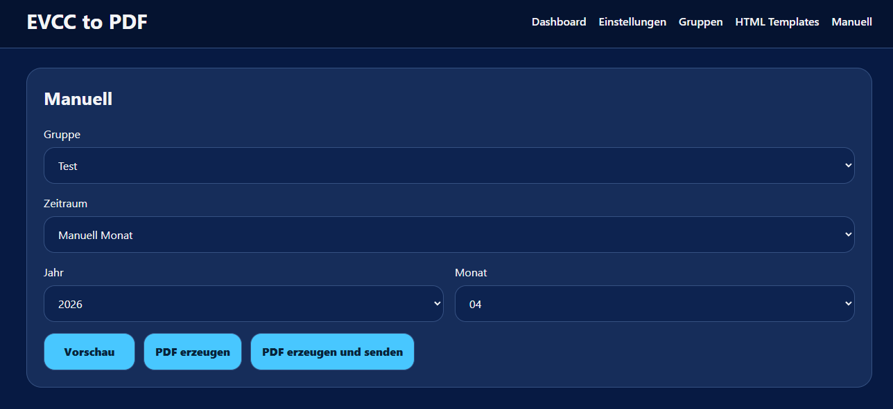
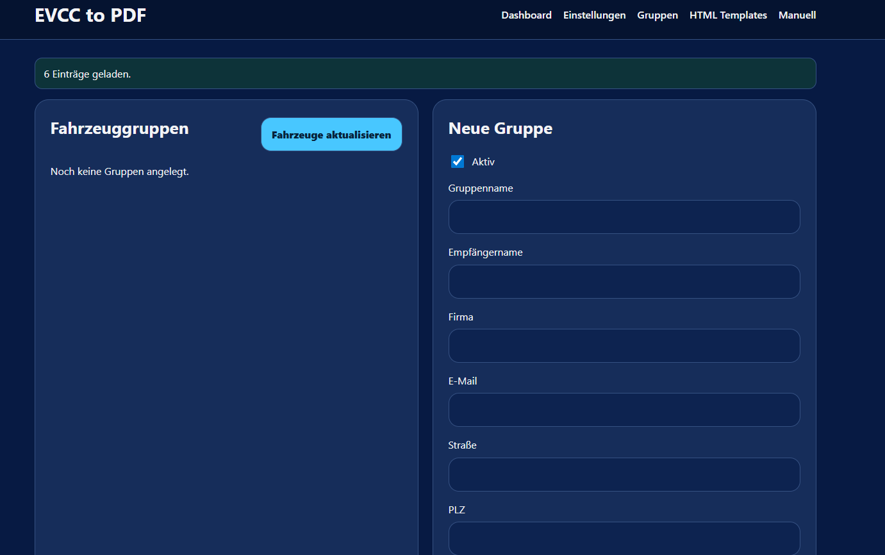
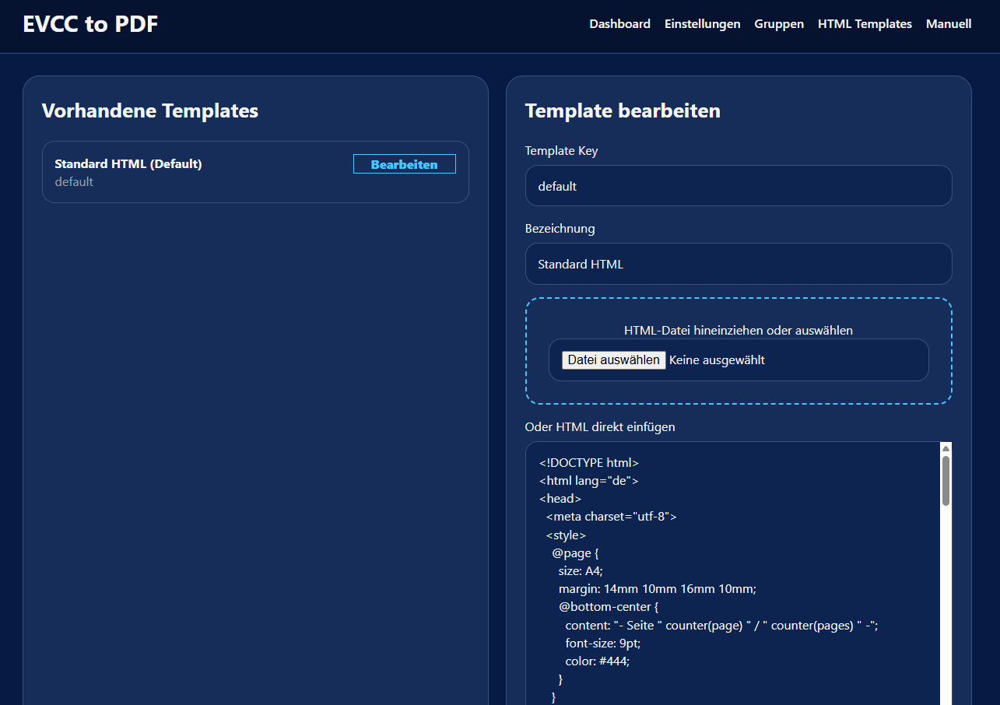

# EVCC to PDF

Automatisierte Abrechnung von Ladevorgängen aus EVCC als PDF inklusive E-Mail Versand.

---

## 💡 Ziel

Ein einfaches, automatisches Abrechnungssystem für EV-Ladungen zu Hause.

---

## 🔗 Repository

https://github.com/fbo1982/evcc_to_pdf_addon.git

---

## 🏠 Direkt in Home Assistant hinzufügen

---

## ⚙️ Installation

### Automatisch
Button oben klicken

### Manuell

1. Einstellungen → Add-ons  
2. Add-on Store  
3. ⋮ → Repositories  
4. hinzufügen: https://github.com/fbo1982/evcc_to_pdf_addon.git
5. installieren & starten

---

## 📸 Screenshots

### Manuell

### Gruppen

### Templates

---

## 🚀 Features

- PDF-Abrechnung aus EVCC
- Automatischer E-Mail Versand
- Gruppenverwaltung
- Abrechnungsmodi:
  - Monatlich
  - Quartal
  - Halbjährlich
  - Jährlich
- Automatik (Scheduler)
- HTML Templates
- Bankdaten
- CC an Absender
- Safe Storage

---

## 🔄 Automatik

- berücksichtigt Gruppen (nur aktive)
- verhindert doppelte Abrechnungen
- basiert auf Zeiträumen

---

## 🧪 Testbereich

- Vorschau
- manuelle PDF-Erstellung
- Testversand

---

## 📦 Releases

👉 https://github.com/fbo1982/evcc_to_pdf_addon/releases

---

## ⚠️ Hinweis

Dieses Projekt ist produktiv nutzbar, wird aber aktiv weiterentwickelt.

---

## 📄 Lizenz

MIT License
