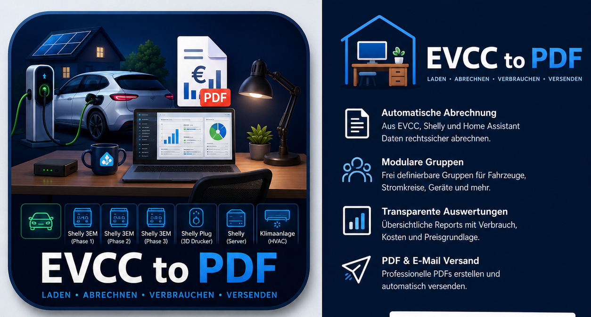
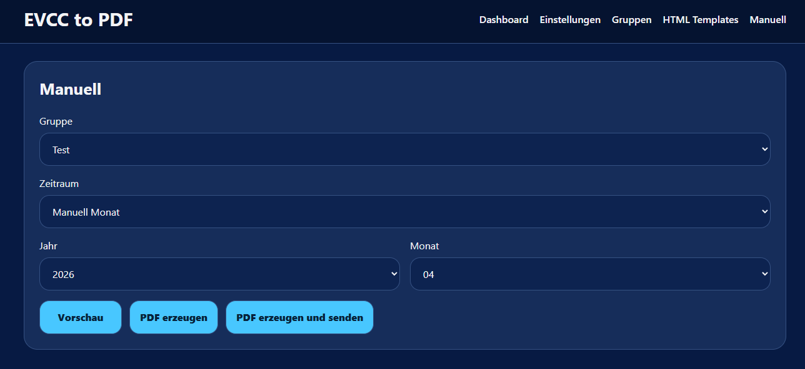
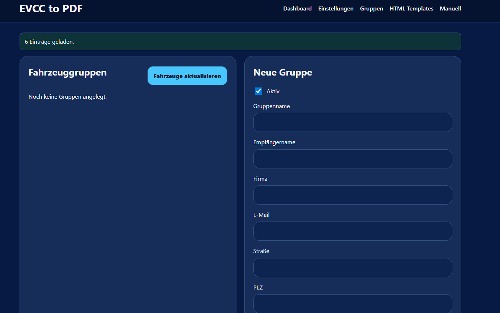
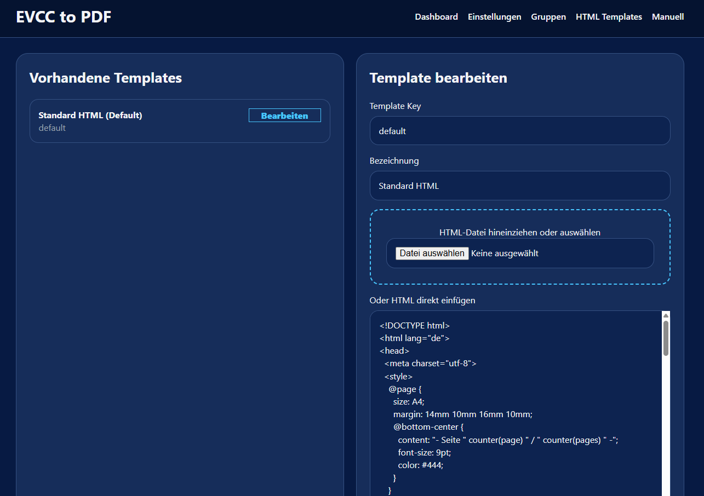

<p align="center">
  
</p>

<p align="center">
  
  
  
  
</p>

# EVCC to PDF

**EVCC to PDF** erstellt aus EVCC-Ladevorgängen nachvollziehbare PDF-Abrechnungen für zuhause geladene Firmen- oder Dienstfahrzeuge – inklusive Fahrzeugaufteilung, Strompreisermittlung und optionalem E-Mail-Versand.

Das Home-Assistant-App richtet sich besonders an Nutzer, die Ladeenergie an der privaten Wallbox regelmäßig gegenüber ihrem Arbeitgeber abrechnen möchten.

## Highlights

- Automatische PDF-Abrechnung aus EVCC-Ladevorgängen
- Auswertung getrennt nach Fahrzeugen inklusive Zwischensummen
- Strompreis je Gruppe wahlweise manuell oder per **BMF-Strompreispauschale**
- Automatische Ermittlung des amtlichen Destatis-Werts für unterstützte Abrechnungsjahre
- Anzeige des zugrunde gelegten Strompreises direkt in der Auswertung
- Monatliche, quartalsweise, halbjährliche oder jährliche Abrechnung
- Automatischer E-Mail-Versand mit PDF-Anhang
- Gruppen für unterschiedliche Fahrzeuge, Empfänger und Abrechnungsregeln
- HTML-Template-Verwaltung mit grafischem Editor
- Persistente, atomare Speicherung mit Backups und MQTT-Fallback
- Home-Assistant-Ingress – keine separate Portfreigabe nötig

## Installation in Home Assistant

### Mit einem Klick

[](https://my.home-assistant.io/redirect/supervisor_addon_repository/?repository_url=https://github.com/fbo1982/evcc_to_pdf_addon.git)

### Manuell

1. **Einstellungen → Apps → App-Store** öffnen.
2. Oben rechts **Repositories** auswählen.
3. `https://github.com/fbo1982/evcc_to_pdf_addon.git` hinzufügen.
4. **EVCC to PDF** installieren und starten.
5. Optional **In Seitenleiste anzeigen** aktivieren.
6. Weboberfläche öffnen und EVCC, SMTP und Gruppen konfigurieren.

## Schnellstart

1. Unter **Einstellungen** die EVCC-URL hinterlegen.
2. Optional SMTP-Daten für den automatischen Versand eintragen.
3. Unter **Gruppen** Empfänger, Fahrzeuge und Abrechnungszeitraum definieren.
4. Strompreis auf **Manuell** oder **BMF-Strompreispauschale automatisch** setzen.
5. Unter **Manuell** eine Vorschau erzeugen und die erste PDF prüfen.
6. Anschließend bei Bedarf den Scheduler aktivieren.

## Strompreispauschale ab 2026

Für unterstützte Abrechnungsjahre kann EVCC to PDF die BMF-Strompreispauschale verwenden. Dabei wird der maßgebliche Destatis-Gesamtstrompreis des ersten Halbjahres des Vorjahres aus der Statistik **61243-0001** herangezogen und entsprechend der BMF-Regel auf volle Cent je kWh abgerundet. Für **2026** ist im Add-on **0,34 €/kWh** hinterlegt.

Bei manueller Preiswahl wird in der Abrechnung nur der verwendete Strompreis ausgegeben. Angaben zur Preisermittlung erscheinen ausschließlich bei aktivierter BMF-Automatik.

> **Hinweis:** EVCC to PDF ist ein technisches Abrechnungswerkzeug und keine Steuer- oder Rechtsberatung. Prüfe die für deinen Arbeitgeber und deinen konkreten Fall geltenden Vorgaben.

## Fahrzeugbasierte Abrechnung

Ladevorgänge werden in der Standardausgabe nach Fahrzeugen gegliedert. Jedes Fahrzeug erhält eine eigene Tabelle und eine Zwischensumme; danach folgt die Gesamtsumme für den Abrechnungszeitraum.

Damit bleiben Abrechnungen auch dann gut nachvollziehbar, wenn über dieselbe EVCC-Installation mehrere Fahrzeuge geladen werden.

## Screenshots

### Manuelle Abrechnung



### Gruppenverwaltung



### HTML-Templates



## Templates

Das mitgelieferte Standardtemplate kann wie ein eigenes Template bearbeitet, ersetzt und – sofern ein anderes Template als Standard gewählt wurde – gelöscht werden. Der grafische Editor arbeitet mit den vorhandenen EVCC-/Jinja-Platzhaltern.

Neue Abrechnungsdaten stehen unter anderem über diese Kontexte zur Verfügung:

- `vehicle_groups`
- `electricity_price`
- `electricity_price_eur_kwh`
- `price_mode`
- `price_method_label`
- `price_source_label`
- `price_source_year`

Eine Übersicht der Platzhalter liegt in [`evcc_to_pdf/PLACEHOLDERS.md`](evcc_to_pdf/PLACEHOLDERS.md).

## Datensicherheit und Persistenz

Konfiguration und benutzerdefinierte Templates werden persistent gespeichert. Schreibvorgänge erfolgen atomar; vor Änderungen werden Sicherungen angelegt. Falls eine lokale Konfiguration beschädigt ist, versucht das Add-on zuerst ein gültiges Backup und anschließend den MQTT-Spiegel zu verwenden.

PDF-Dateien werden unter `/share/evcc-pdfs` abgelegt.

## Projektstruktur

```text
evcc_to_pdf_addon/
├── README.md
├── CHANGELOG.md
├── repository.yaml
├── docs/images/
└── evcc_to_pdf/
    ├── config.yaml
    ├── icon.png
    ├── logo.png
    ├── README.md
    ├── DOCS.md
    ├── app.py
    ├── generate_pdf_report.py
    ├── templates/
    └── static/
```

## Branding

Die App enthält ein eigenes Home-Assistant-Icon (`icon.png`) und Logo (`logo.png`). Zusätzlich werden Logo und Favicon in der EVCC-to-PDF-Weboberfläche verwendet.

## Changelog

Alle Änderungen findest du in [`CHANGELOG.md`](CHANGELOG.md).

## Repository & Releases

- Repository: `https://github.com/fbo1982/evcc_to_pdf_addon`
- Releases: `https://github.com/fbo1982/evcc_to_pdf_addon/releases`

## Lizenz

MIT License – siehe [`LICENSE`](LICENSE).
